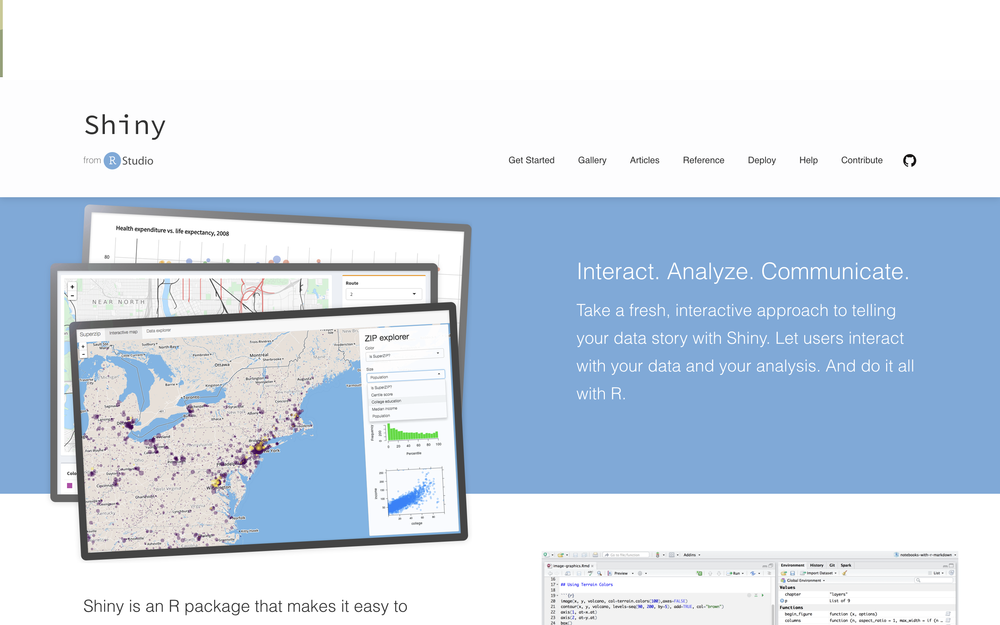
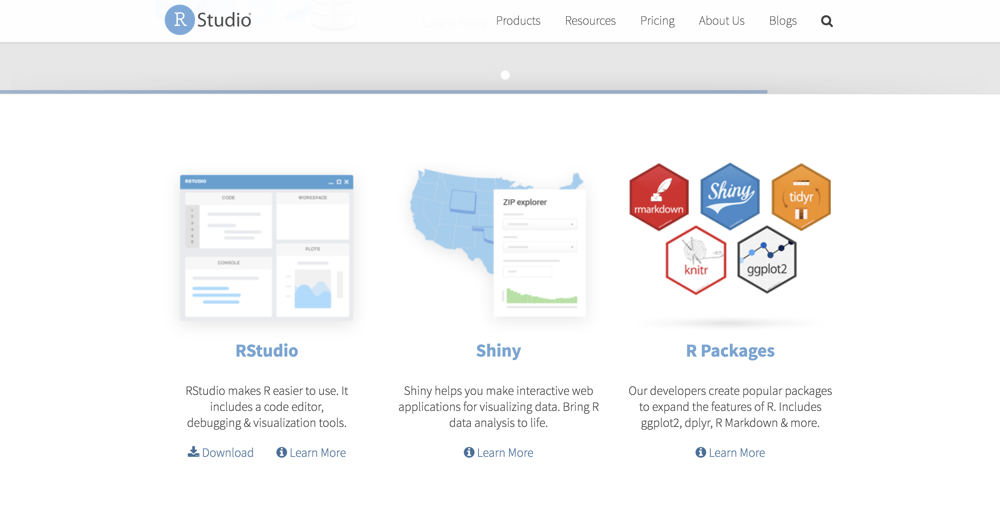
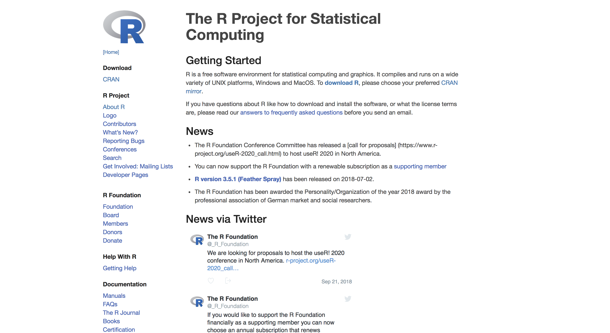
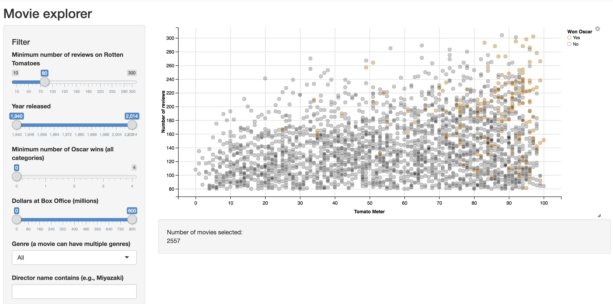
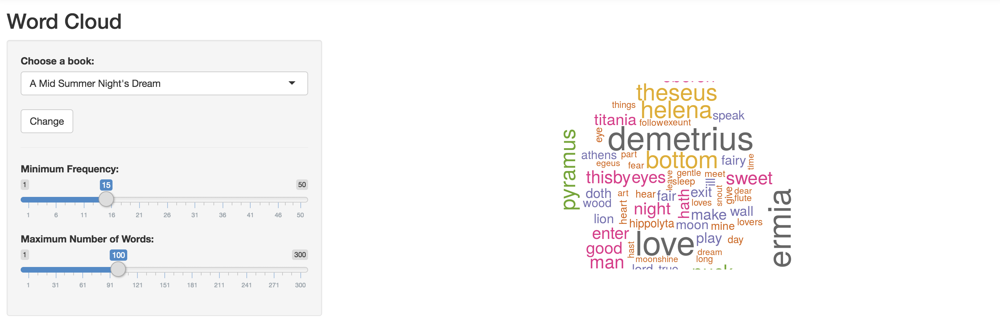
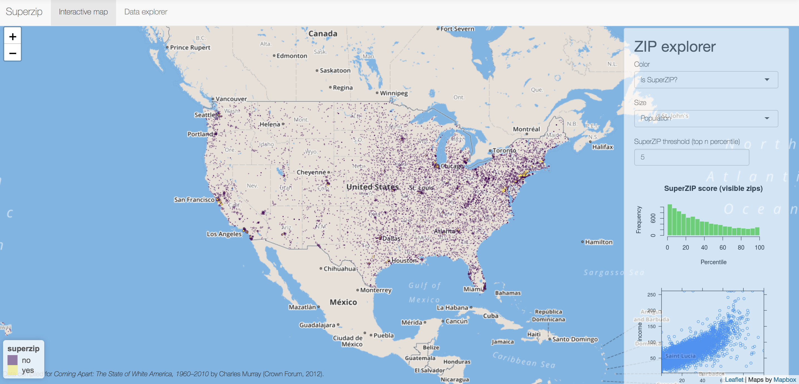
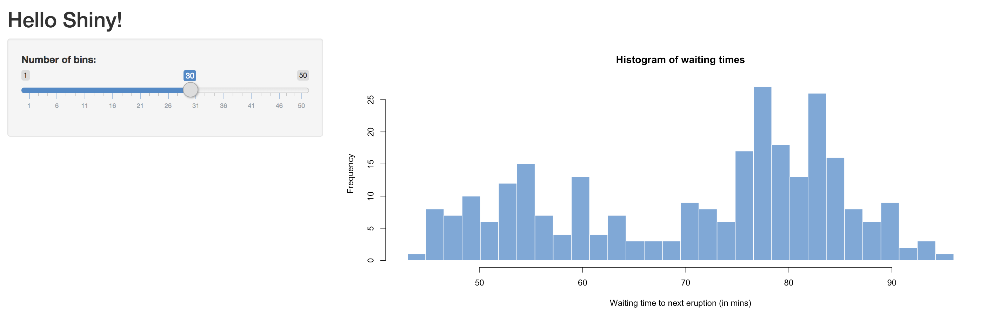

# Shiny

**_What is Shiny?_**

- Shiny is an open source R package that makes it easy to build interactive web apps straight from R.<br/>
- You can host standalone apps on a webpage or embed them in R Markdown documents or build dashboards.<br/>
- You can also extend your shiny apps with CSS themes, htmlwidgets, and JavaScript actions.<br/>



For more information on Shiny you can click [here](https://shiny.rstudio.com/).


**_What is RStudio?_**

RStudio is a company that develops free and open tools for R and enterprise-ready professional products for teams to scale and share work.<br/>



For more information on RStudio you can click [here](https://www.rstudio.com/).


**_What is R?_**

R is a programming language and environment for statistical computing and graphics.



For more information on R you can click [here](https://www.r-project.org/).

### What can you make with Shiny?

Shiny has many examples of different types of Data Visualizations. Below are a few pictures of what types of graphs you can make with Shiny.

_Movie Explorer_


The graph above shows us movies that were made from 1970 - 2014, that made between $0 - $800m, and have a minimum of 10 - 80 rotten tomatoe reviews. You might also notice which movies have won an oscar.

_World Cloud_


This is just a world cloud from the book A Mid Summer Night's Dream where the words need to have a frequency of 1 - 15 and there can only be a maximum of 100 words that can be shown at one time.

_Zipcode Explorer_


Superzip is an interactive map of the US where you can view which states have superzips (Definition of Superzip: Zip Codes in the US with the highest per capita income and college graduation rates.

[Click here](https://shiny.rstudio.com/gallery/) to see Shiny gallery and more exmaples of what you can do with Shiny!

### Learn Shiny!

Shiny allows you to comfortably learn it's usage by taking you through their tutorials. Which can be found by clicking the following link! [Learn Shiny!](https://shiny.rstudio.com/tutorial/) They offer 2 and a half hours worth of videos and a readable 7 lesson tutorial.

**_Let's take a look at Lesson 1 "Welcome to Shiny"_**

If you are new to R you can learn more about it bu clicking [here](https://www.r-project.org/).<br/>
I will also provide a link to the download page [here](https://cran.r-project.org/mirrors.html).<br/>

The Steps below are to get R running on your computer and testing Shiny.<br/>

Steps:
1) Choose server closest to your location.
2) Choose which OS you are using.
3) Click on the package that follows with which situation you would like to download R for.
4) Once downloaded open R and it should look like a terminal.
5) type `install.packages("shiny")`. This will install all shiny packages into R.
6) Then type `library(shiny)` and `runExample("01_hello")`.<br/>
7) To exit press `esc` on your keyboard.
This will open up the example of their hello world project using Shiny and R for you to view.<br/>
There are more examples you may run by viewing this document [here](https://shiny.rstudio.com/tutorial/written-tutorial/lesson1/#Go%20Further).

Your results might look like the following below:



_Here is the `ui` object for the **Hello Shiny** example._
```
library(shiny)

# Define UI for app that draws a histogram ----
ui <- fluidPage(

  # App title ----
  titlePanel("Hello Shiny!"),

  # Sidebar layout with input and output definitions ----
  sidebarLayout(

    # Sidebar panel for inputs ----
    sidebarPanel(

      # Input: Slider for the number of bins ----
      sliderInput(inputId = "bins",
                  label = "Number of bins:",
                  min = 1,
                  max = 50,
                  value = 30)

    ),

    # Main panel for displaying outputs ----
    mainPanel(

      # Output: Histogram ----
      plotOutput(outputId = "distPlot")

    )
  )
)
```

_Here is the `server` function for the **Hello Shiny** example._
```
# Define server logic required to draw a histogram ----
server <- function(input, output) {

  # Histogram of the Old Faithful Geyser Data ----
  # with requested number of bins
  # This expression that generates a histogram is wrapped in a call
  # to renderPlot to indicate that:
  #
  # 1. It is "reactive" and therefore should be automatically
  #    re-executed when inputs (input$bins) change
  # 2. Its output type is a plot
  output$distPlot <- renderPlot({

    x    <- faithful$waiting
    bins <- seq(min(x), max(x), length.out = input$bins + 1)

    hist(x, breaks = bins, col = "#75AADB", border = "white",
         xlab = "Waiting time to next eruption (in mins)",
         main = "Histogram of waiting times")

    })

}
```
### Shiny with other Data Vis. APIs

Shiny can be used with other libraries in R by inputting `library(name_of_library)` (Ex: library(shiny)). This will allow use of another library in R. Since you can add multiple libraries in R you can use Shiny with other Javascript libraries such as d3, Leaflet, and Google Charts. 

Markdown is a lightweight and easy-to-use syntax for styling your writing. It includes conventions for

```markdown
Syntax highlighted code block

# Header 1
## Header 2
### Header 3

- Bulleted
- List

1. Numbered
2. List

**Bold** and _Italic_ and `Code` text

[Link](url) and 
```

For more details see [GitHub Flavored Markdown](https://guides.github.com/features/mastering-markdown/).
[here](https://github.com/creighton-gorai/Shiny/edit/master/README.md)

### Jekyll Themes

Your Pages site will use the layout and styles from the Jekyll theme you have selected in your [repository settings](https://github.com/creighton-gorai/Shiny/settings). The name of this theme is saved in the Jekyll `_config.yml` configuration file.

### Support or Contact

Having trouble with Pages? Check out our [documentation](https://help.github.com/categories/github-pages-basics/) or [contact support](https://github.com/contact) and we’ll help you sort it out.
