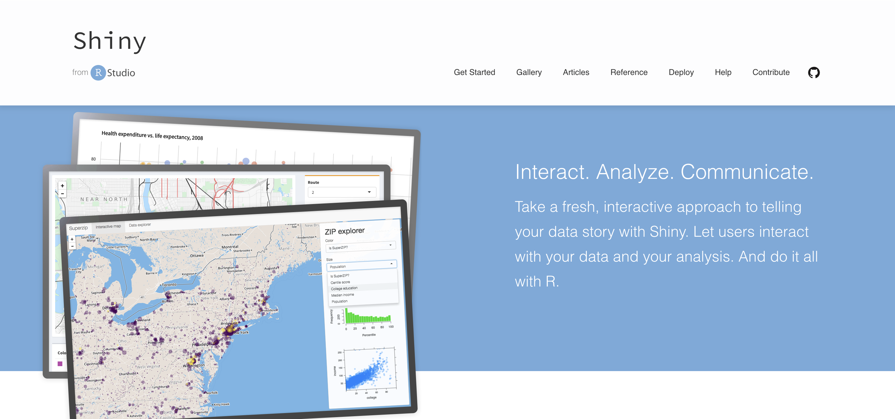

# Shiny

**_What is Shiny?_**

- Shiny is an open source R package that makes it easy to build interactive web apps straight from R.<br/>
- You can host standalone apps on a webpage or embed them in R Markdown documents or build dashboards.<br/>
- You can also extend your shiny apps with CSS themes, htmlwidgets, and JavaScript actions.<br/>



For more information on Shiny you can click [here](https://shiny.rstudio.com/).

**_What is RStudio?_**

RStudio is a company that develops free and open tools for R and enterprise-ready professional products for teams to scale and share work.<br/>


For more information on RStudio you can click [here](https://www.rstudio.com/).

**_What is R?_**

R is a programming language and environment for statistical computing and graphics.


For more information on R you can click [here](https://www.r-project.org/).

## What can Shiny do?

### Shiny with R programming

If you are new to R you can learn more about it with the link above.<br/>
I will also provide a link to the download page [here](https://cran.r-project.org/mirrors.html)<br/>
The Steps below are to get R running on your computer and test.<br/>

Steps:
1) Choose server closest to your location.
2) Choose which OS you are using
3) Click on the package that follows with which situation you would like to download R for.
4) Once downloaded open R and it should look like a terminal
5) type `install.packages("shiny")`. This will install all shiny packages into R.
6) Then type `library(shiny)` and `runExample("01_hello")`<br/>
This will open up the example of their hello world project using Shiny and R for you to view.<br/>
There are other examples you may run by viewing this document [here](https://shiny.rstudio.com/tutorial/written-tutorial/lesson1/#Go%20Further).

### Shiny with other Data Vis. APIs

Shiny can be used with other libraries in R by inputting `library(name_of_library)` (Ex: library(shiny)). This will allow use of another library in R. Since you can add multiple libraries in R you can use Shiny with other Javascript libraries such as d3, Leaflet, and Google Charts. 

Markdown is a lightweight and easy-to-use syntax for styling your writing. It includes conventions for

```markdown
Syntax highlighted code block

# Header 1
## Header 2
### Header 3

- Bulleted
- List

1. Numbered
2. List

**Bold** and _Italic_ and `Code` text

[Link](url) and 
```

For more details see [GitHub Flavored Markdown](https://guides.github.com/features/mastering-markdown/).
[here](https://github.com/creighton-gorai/Shiny/edit/master/README.md)

### Jekyll Themes

Your Pages site will use the layout and styles from the Jekyll theme you have selected in your [repository settings](https://github.com/creighton-gorai/Shiny/settings). The name of this theme is saved in the Jekyll `_config.yml` configuration file.

### Support or Contact

Having trouble with Pages? Check out our [documentation](https://help.github.com/categories/github-pages-basics/) or [contact support](https://github.com/contact) and we’ll help you sort it out.
